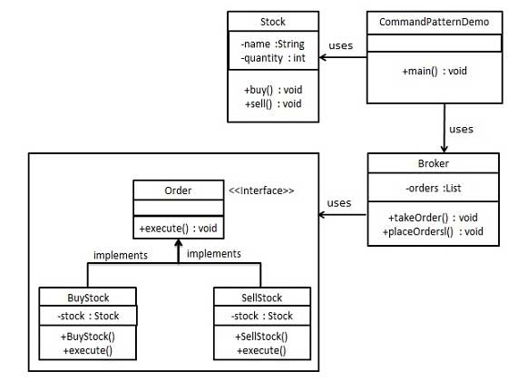

# 命令模式（command）

**侧重点：**类似于事务处理等，调用者需要记录其中的状态

**何时使用：**在某些场合，比如要对行为进行"记录、撤销/重做、事务"等处理，这种无法抵御变化的紧耦合是不合适的。在这种情况下，如何将"行为请求者"与"行为实现者"解耦？将一组行为抽象为对象，可以实现二者之间的松耦合。

**如何解决：**通过调用者调用接受者执行命令，顺序：调用者→接受者→命令。

**关键代码：**定义三个角色：1、received 真正的命令执行对象 2、Command 3、invoker 使用命令对象的入口

**应用实例：**struts 1 中的 action 核心控制器 ActionServlet 只有一个，相当于 Invoker，而模型层的类会随着不同的应用有不同的模型类，相当于具体的 Command。